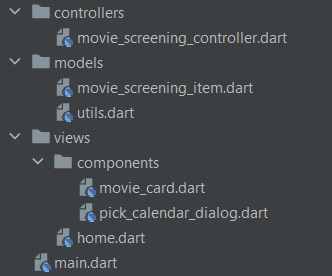
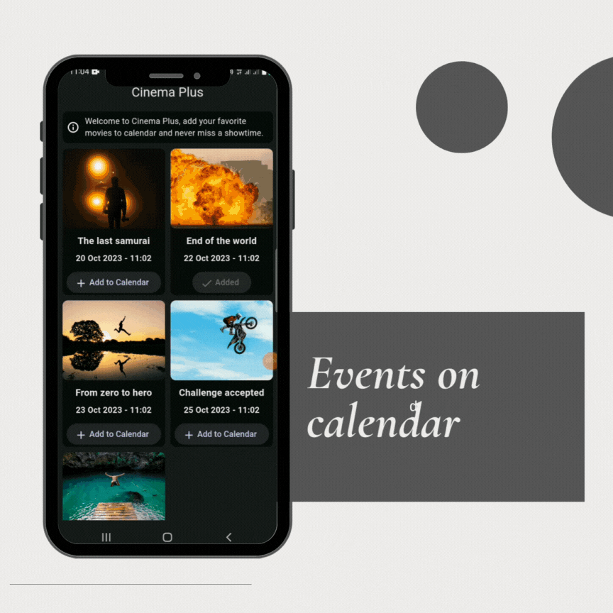

# Flutter calendar events

A demo manipulation on Flutter device's calendar.
A small application for a cinema to view how device's calendars can be manipulated in Flutter and Dart. It is on a simple page where there will be a list of movies and their screening date.

The user can add the screening movie event to the calendar of their choice, if a movie has already been added to any of these calendars it will be impossible to add it a second time.

## Architecture

We will use a simple [MVC](https://en.wikipedia.org/wiki/Model%E2%80%93view%E2%80%93controller) (Model-View-Controller) architecture.

### Model

The model will be the data of our application, in our case it will be the list of movies and their screening date.

### View

The view will be the visual part of our application, in our case it will be the list of movies and their screening date.

### Controller

The controller will be the link between the model and the view, it will allow to manipulate the data of the model and to update the view.

## Demo

## Tutorial

To learn how to create this application, you can follow these tutorials:

🇬🇧 🇺🇸 [Learn how to manage your calendar events in Flutter and Dart](https://lyabs.hashnode.dev/learn-how-to-manage-your-calendar-events-in-flutter-and-dart#heading-view)

🇫🇷 [Apprenez à ajouter et à gérer vos événements de calendrier en Flutter et Dart](https://medium.com/@loicyabili/apprenez-%C3%A0-ajouter-et-%C3%A0-g%C3%A9rer-vos-%C3%A9v%C3%A9nements-de-calendrier-en-flutter-et-dart-0730dacb6a56)